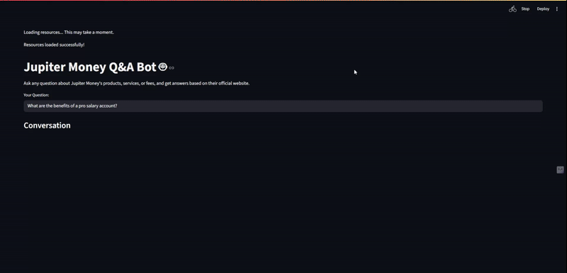
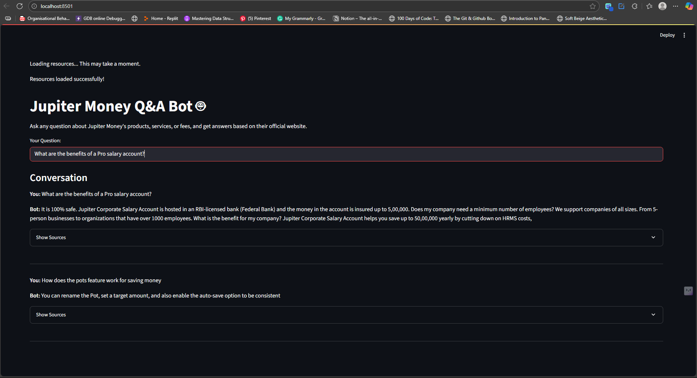
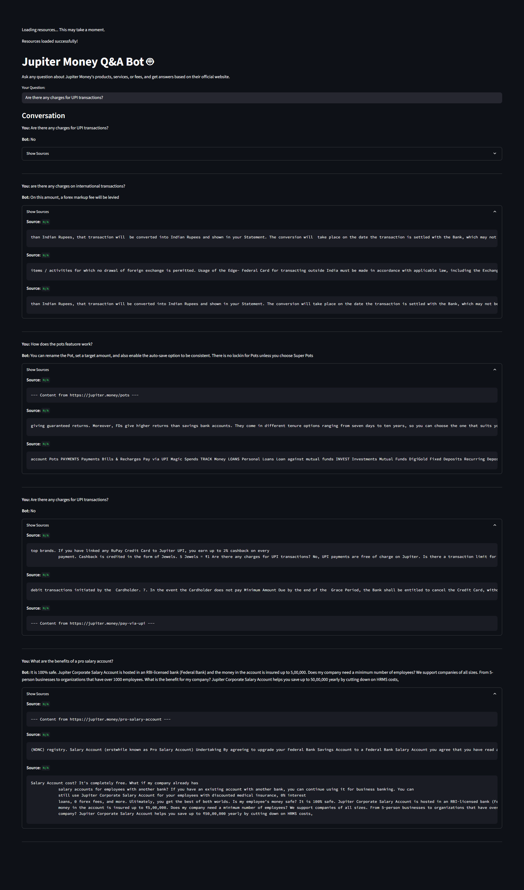

# 🤖It's the Jupiter Money Oracle.

### Ever tried asking a bank a question? It's like shouting into the void. This project fixes that.

This isn't just another chatbot. It's a fully autonomous Q\&A system built to cut through the corporate jargon on the Jupiter Money website and give you straight answers. No more hunting through FAQs. No more waiting for support tickets. Just ask a question, get an answer.

**Built by Arshad Jamal.**

**Video Demo**



## 💥 The Lowdown: What This Beast Does

  * **Scrapes & Ingests Knowledge:** It starts by acting like a digital librarian with an insatiable appetite, crawling and scraping the *entire* Jupiter Money website.
  * **Answers the Un-askable:** Ask it anything about products, fees, features, or terms. It uses a Retrieval-Augmented Generation (RAG) pipeline to find the *exact* information and formulate a human-like answer.
  * **Grounded in Truth:** This bot doesn't make things up. Its knowledge is strictly limited to the data scraped from the website, making its answers reliable and fact-based.
  * **Shows Its Work:** Not sure if you can trust the answer? The bot provides the source text it used to generate the response. Total transparency.
  * **Slick, Interactive UI:** No command-line nonsense. A clean, fast, and responsive web app built with Streamlit makes it easy for anyone to use.

-----


### Check out the magic:

<p align="center">
  
  <br>
  <em>The main interface in action.</em>
  <br><br>
  
  <br>
  <em>Transparency: See the source of the answers.</em>
</p>

-----

## 🛠️ The Tech Stack: The Weapons of Choice

This project was forged using a 100% open-source, killer tech stack. No expensive API calls here.

  * **Web Crawling/Scraping:** `requests` & `BeautifulSoup4`
  * **AI Orchestration & Data Processing:** `LangChain`
  * **Natural Language Processing (Embeddings):** `Sentence-Transformers` (`all-MiniLM-L6-v2`)
  * **Vector Database (The Brain):** `FAISS` by Facebook AI - for lightning-fast semantic search.
  * **The AI Core (LLM):** `google/flan-t5-large` - A powerful, self-hosted open-source language model.
  * **The Frontend:** `Streamlit` - Because who has time for JavaScript?

-----

## 🧠 The 'How It Works' Deconstructed

This isn't magic, it's just damn good engineering. Here's the 4-step process:

1.  **Crawl & Scrape:** A custom crawler (`crawler.py`) automatically discovers every relevant, non-blog page on `jupiter.money`. Then, a scraper (`scraper.py`) rips the text content from them.
2.  **Chunk & Embed:** The raw text is broken down into smaller, digestible chunks. Each chunk is then converted into a mathematical representation (a vector embedding) that captures its semantic meaning.
3.  **Store:** All these vectors are loaded into a `FAISS` vector store (`03_build_vector_store.py`), creating a searchable, high-speed knowledge base.
4.  **Retrieve & Generate:** When you ask a question, the app (`app.py`) converts your query into a vector, finds the most relevant chunks of text from the `FAISS` store, and then feeds those chunks—along with your original question—to the `Flan-T5` model. The model then generates a coherent answer based *only* on the context it was given. **This is the RAG pipeline.**

-----

## 🚀 How to Run This Beast

Want to run it locally? Don't just stand there, fire it up.

**Prerequisites:** Python 3.8+ and `pip`.

1.  **Clone the Repo:**

    ```bash
    git clone https://github.com/your-username/your-repo-name.git
    cd your-repo-name
    ```

2.  **Set Up the Environment & Install Dependencies:**

    ```bash
    # Create a virtual environment (trust me, it's good practice)
    python -m venv .venv
    source .venv/bin/activate  # On Windows, use `.venv\Scripts\activate`

    # Install the whole damn thing
    pip install -r requirements.txt
    ```

    *(Note: You'll need to create a `requirements.txt` file using `pip freeze > requirements.txt`)*

3.  **Build the Knowledge Base:**

      * This is a two-step process. First, run the crawler, then the scraper.
        ```bash
        python crawler.py
        python scraper.py
        ```
      * Now, build the vector store. This will download the embedding model the first time.
        ```bash
        python 03_build_vector_store.py
        ```

4.  **Launch the App:**

      * This will download the `flan-t5-large` model the first time (it's about 3GB, so be patient).
        ```bash
        streamlit run app.py
        ```
      * Your browser should automatically open with the app running. Go ask it something hard.

-----

## 🤔 Why This Isn't Just Another Toy Bot

Building this project isn't just about making a cool demo. It's a masterclass in the end-to-end workflow of a modern, practical AI application. It proves you can:

  * **Tame Unstructured Data:** Turn a messy, real-world website into a structured knowledge base.
  * **Implement Advanced AI Architectures:** Build and deploy a RAG pipeline from scratch.
  * **Leverage Open-Source:** Create powerful AI systems without relying on paid, black-box APIs.
  * **Build for Humans:** Go beyond a Jupyter Notebook and create a polished, usable product with a proper frontend.

This is the kind of project that gets you noticed.

-----

## 🔮 Future Scheming

This thing is cool, but it could be a monster.

  * **Swap the Brain:** Drop in a more powerful open-source LLM like Mistral or Llama 3.
  * **Memory:** Implement conversation history so the bot can remember what you talked about earlier.
  * **Containerize It:** Wrap the entire application in Docker for one-command deployment.
  * **Go Beyond Text:** Scrape tables and financial data to answer even more complex questions like "Compare the fees for the Edge+ and Edge Visa cards."